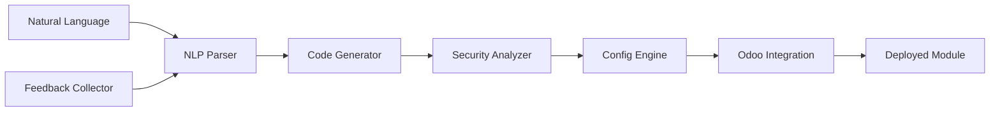

# AI-Driven Odoo SaaS Platform

[](https://opensource.org/licenses/MIT)
[](https://www.python.org/downloads/)
[](https://www.odoo.com/)

> Transform natural language requirements into production-ready Odoo modules using AI

## 🚀 Overview

The AI-Driven Odoo SaaS Platform leverages artificial intelligence to automate and streamline Odoo module creation and configuration. Users can describe their business requirements in plain English, and the system instantly generates complete, secure, and deployable Odoo modules.

### ✨ Key Features

- **🤖 Natural Language Processing**: Describe requirements in plain English
- **⚡ Instant Code Generation**: Complete Odoo modules in seconds
- **🔒 Security-First**: Automated vulnerability scanning and compliance checking
- **🎯 Intelligent Configuration**: Industry-specific optimizations and best practices
- **📊 Continuous Learning**: Improves from user feedback and usage patterns
- **🚀 One-Click Deployment**: Seamless integration with Odoo instances

## 🎯 Quick Start

### Installation

```bash
# Install from source
git clone https://github.com/ht2cloud/odoo-saas-ai.git
cd odoo-saas-ai
pip install -e .
```

### Try the Live Demo

```bash
# Start the interactive web demo
odoo-ai-generator demo

# Open your browser to: http://localhost:5000
```

The web demo provides:
- 🌐 **Interactive Chat Interface** - Describe modules in plain English
- ⚡ **Real-time Generation** - Watch progress as modules are created
- 📊 **Live Statistics** - See files, models, views, and security scores
- 📦 **Instant Download** - Get complete, ready-to-use modules
- 🚀 **Demo Deployment** - Simulated Odoo instance integration

### Generate Your First Module

```bash
# Generate a customer management module
odoo-ai-generator generate "I need a customer management system with contact tracking and sales pipeline"

# Generate with security analysis
odoo-ai-generator generate "Employee management with payroll integration" --security-scan --gdpr

# Generate and deploy to Odoo
odoo-ai-generator generate "Inventory management with barcode scanning" --deploy --odoo-config config.json
```

### Example Output

```
✓ Module generated: custom_customer_management
✓ Models created: 3 (Customer, Contact, Opportunity)
✓ Views created: 9 (Forms, Trees, Kanban, Search)
✓ Security scan: PASSED (Score: 98/100)
✓ GDPR compliance: VALIDATED
✓ Files written to: ./generated_modules/custom_customer_management/
```

## 🏗️ Architecture

The platform consists of seven core components that work together to transform natural language into production-ready code:



### Core Components

1. **[NLP Parser](ai_module_generator/nlp_parser.py)** - Converts natural language to structured specifications
2. **[Code Generator](ai_module_generator/code_generator.py)** - Generates complete Odoo modules
3. **[Security Analyzer](ai_module_generator/security.py)** - Scans for vulnerabilities and compliance issues
4. **[Configuration Engine](ai_module_generator/config_engine.py)** - Optimizes settings and workflows
5. **[Odoo Integration](ai_module_generator/integration.py)** - Handles deployment and management
6. **[Feedback Collector](ai_module_generator/feedback.py)** - Enables continuous learning
7. **[CLI Interface](ai_module_generator/cli.py)** - Command-line access to all features

## 💡 Usage Examples

### Basic Module Generation

```bash
# Simple CRM system
odoo-ai-generator generate "Customer relationship management with lead tracking"

# Project management
odoo-ai-generator generate "Project management with task tracking and time logging"

# Inventory system
odoo-ai-generator generate "Warehouse management with stock levels and reorder points"
```

### Advanced Configuration

```bash
# Industry-specific generation
odoo-ai-generator generate \
  "Patient record management" \
  --industry healthcare \
  --hipaa \
  --security-scan

# Custom configuration
odoo-ai-generator generate \
  "Financial reporting system" \
  --configure \
  --gdpr \
  --security-report security.txt
```

### Deployment and Integration

```bash
# Test Odoo connection
odoo-ai-generator test-connection odoo-config.json

# Deploy with validation
odoo-ai-generator generate \
  "Sales dashboard with analytics" \
  --deploy \
  --odoo-config production.json \
  --security-scan
```

### Feedback and Analytics

```bash
# Submit feedback
odoo-ai-generator submit-feedback my_module user123 --rating 5 --content "Excellent module!"

# Analyze patterns
odoo-ai-generator feedback --insights --days 30
```

## 🔧 Configuration

### Odoo Connection

Create `odoo-config.json`:

```json
{
  "url": "your-odoo-instance.com",
  "database": "your_database",
  "username": "admin",
  "password": "your_password",
  "port": 8069,
  "protocol": "https"
}
```

### Advanced Settings

Create `config.yml`:

```yaml
generation:
  default_author: "Your Company"
  include_tests: true
  code_style: "odoo"

security:
  enable_analysis: true
  compliance_frameworks: ["gdpr", "hipaa"]
  severity_threshold: "medium"

ai:
  openai_api_key: "your-api-key"  # Optional
  use_local_models: true
  model_cache_size: "1GB"
```

## 🛡️ Security & Compliance

### Automated Security Analysis

- **Vulnerability Detection**: SQL injection, XSS, hardcoded secrets
- **Code Quality**: Best practices enforcement, performance optimization
- **Access Control**: Permission validation, privilege escalation prevention

### Compliance Frameworks

- **GDPR**: Data protection and privacy requirements
- **HIPAA**: Healthcare data security standards
- **SOX**: Financial reporting controls
- **PCI-DSS**: Payment card industry security
- **ISO 27001**: Information security management

### Security Report Example

```
Security Analysis Report for custom_crm_module
==============================================
Scan Date: 2024-01-15 10:30:00
Overall Score: 95.5/100
Status: PASSED

Security Issues: 1 (Low severity)
Compliance Issues: 0

[LOW] Missing Input Validation
  File: models/customer.py:42
  Description: User input handling without validation
  Recommendation: Add proper input validation
```

## 📊 Learning & Feedback

### Continuous Improvement

The platform learns from:
- **User Feedback**: Ratings, suggestions, bug reports
- **Usage Patterns**: Feature adoption, common modifications
- **Performance Metrics**: Generation success rates, deployment outcomes

### Analytics Dashboard

```bash
# View feedback summary
odoo-ai-generator feedback --module my_crm --days 30

Output:
Total Feedback: 47
Average Rating: 4.2/5
Feature Requests: 8
Bug Reports: 2
Success Rate: 94%
```

## 🧪 Testing

### Run Tests

```bash
# Run all tests
pytest

# Run specific component tests
pytest ai_module_generator/tests/test_nlp_parser.py

# Run with coverage
pytest --cov=ai_module_generator --cov-report=html
```

### Integration Tests

```bash
# Test with real Odoo instance
pytest ai_module_generator/tests/integration/ --odoo-config test-config.json
```

## 📚 Documentation

- **[Blueprint](docs/BLUEPRINT.md)** - Project vision and roadmap
- **[Demo Guide](docs/DEMO.md)** - Web interface and live demo
- **[Architecture](docs/architecture.md)** - Technical architecture details
- **[User Flows](docs/user_flows.md)** - Interaction patterns and workflows
- **[API Reference](docs/api.md)** - Programmatic interface documentation

## 🤝 Contributing

We welcome contributions! Please see our [Contributing Guide](CONTRIBUTING.md) for details.

### Development Setup

```bash
# Clone repository
git clone https://github.com/ht2cloud/odoo-saas-ai.git
cd odoo-saas-ai

# Install development dependencies
pip install -e ".[dev]"

# Run tests
pytest

# Format code
black ai_module_generator/
flake8 ai_module_generator/
```

### Code Quality

- **Black** for code formatting
- **Flake8** for linting
- **MyPy** for type checking
- **Pytest** for testing
- **Pre-commit** hooks for quality gates

## 🌟 Examples & Use Cases

### Business Applications

- **CRM Systems**: Lead management, customer tracking, sales pipelines
- **ERP Solutions**: Inventory, accounting, HR, project management
- **E-commerce**: Product catalogs, order management, shipping
- **Healthcare**: Patient records, appointment scheduling, billing
- **Manufacturing**: Production planning, quality control, maintenance

### Technical Features

- **Multi-tenancy**: Separate data for different organizations
- **Workflow Automation**: Approval processes, notifications, escalations
- **Reporting & Analytics**: Custom dashboards, KPI tracking, data visualization
- **Integration**: REST APIs, webhooks, third-party connectors
- **Mobile Support**: Responsive views, mobile-optimized interfaces

## 📈 Roadmap

### Current Version (v0.1.0)
- ✅ Core NLP parsing
- ✅ Code generation engine
- ✅ Security analysis
- ✅ Basic Odoo integration
- ✅ CLI interface

### Upcoming Features (v0.2.0)
- 🔄 Web-based interface
- 🔄 Advanced AI models (GPT-4 integration)
- 🔄 Multi-language support
- 🔄 Template marketplace
- 🔄 Real-time collaboration

### Future Vision (v1.0.0)
- 🔮 Multi-platform support (SAP, Salesforce)
- 🔮 Visual module designer
- 🔮 Automated testing generation
- 🔮 Enterprise deployment tools
- 🔮 AI-powered optimization

## 📄 License

This project is licensed under the MIT License - see the [LICENSE](LICENSE) file for details.

## 🙏 Acknowledgments

- **Odoo Community** for the amazing ERP platform
- **OpenAI** for language model inspiration
- **Hugging Face** for transformer models
- **Contributors** who help improve the platform

## 📞 Support

- **GitHub Issues**: Bug reports and feature requests
- **Discussions**: Community support and questions
- **Email**: enterprise@ht2cloud.com for commercial support
- **Documentation**: Comprehensive guides and examples

---

**Ready to revolutionize your Odoo development?** Start generating modules in minutes!
