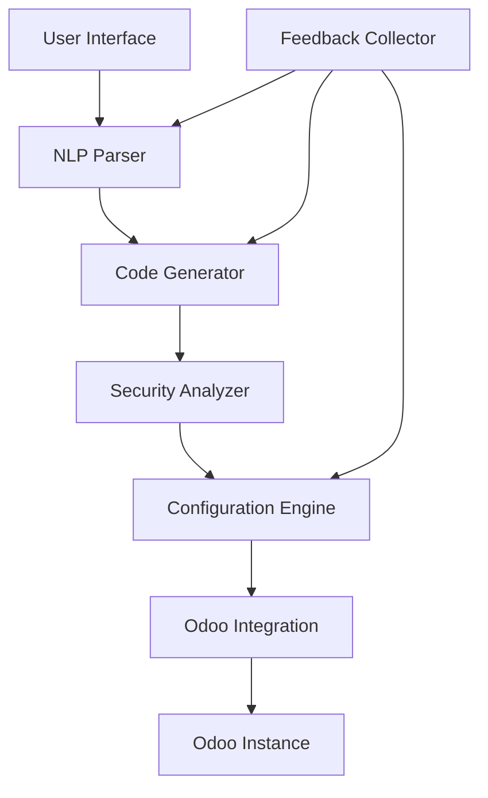

# Technical Architecture

## Overview

The AI-Driven Odoo SaaS Platform is designed as a modular, extensible system that transforms natural language requirements into fully functional Odoo modules. The architecture follows clean separation of concerns and supports both local and cloud deployment scenarios.

## System Architecture

### High-Level Components



### Component Details

#### 1. NLP Parser (`nlp_parser.py`)
- **Responsibility**: Natural language understanding and requirement parsing
- **Input**: Free-form text descriptions
- **Output**: Structured `ModuleSpec` objects
- **Key Classes**:
  - `NLPParser`: Main parsing engine
  - `ModuleSpec`: Complete module specification
  - `Model`, `Field`, `View`: Core Odoo entities

#### 2. Code Generator (`code_generator.py`)
- **Responsibility**: Translating specifications into Odoo code
- **Input**: `ModuleSpec` objects
- **Output**: Complete Odoo module files
- **Key Features**:
  - Jinja2 templating engine
  - Multiple output formats (Python, XML, CSV)
  - Code validation and syntax checking

#### 3. Security Analyzer (`security.py`)
- **Responsibility**: Security vulnerability detection and compliance checking
- **Input**: Generated module files
- **Output**: Security scan reports
- **Key Features**:
  - AST-based Python analysis
  - XML security scanning
  - GDPR/HIPAA compliance checking

#### 4. Configuration Engine (`config_engine.py`)
- **Responsibility**: Intelligent configuration optimization
- **Input**: Module specifications and user requirements
- **Output**: Optimized configurations
- **Key Features**:
  - Industry-specific templates
  - Security rule generation
  - Workflow optimization

#### 5. Odoo Integration (`integration.py`)
- **Responsibility**: Communication with Odoo instances
- **Input**: Generated modules and deployment commands
- **Output**: Deployment status and results
- **Key Features**:
  - XML-RPC communication
  - Module lifecycle management
  - Remote administration

#### 6. Feedback Collector (`feedback.py`)
- **Responsibility**: Learning from user interactions
- **Input**: User feedback and usage metrics
- **Output**: Learning insights and improvement suggestions
- **Key Features**:
  - SQLite-based storage
  - Pattern analysis
  - Automated insight generation

## Data Flow Architecture

### 1. Requirement Processing Flow
```
Natural Language Input
    ↓
Text Preprocessing
    ↓
Entity Extraction
    ↓
Relationship Analysis
    ↓
Field Type Inference
    ↓
Structured Specification
```

### 2. Code Generation Flow
```
ModuleSpec
    ↓
Template Selection
    ↓
Context Preparation
    ↓
Code Generation
    ↓
Validation
    ↓
File Output
```

### 3. Security Analysis Flow
```
Generated Files
    ↓
Syntax Parsing
    ↓
Vulnerability Detection
    ↓
Compliance Checking
    ↓
Risk Assessment
    ↓
Security Report
```

## Technology Stack

### Core Technologies
- **Python 3.8+**: Primary programming language
- **Jinja2**: Template engine for code generation
- **SQLite**: Local data storage for feedback
- **XML-RPC**: Odoo communication protocol

### AI/ML Components
- **Transformers**: Local NLP processing
- **OpenAI API**: Optional enhanced language understanding
- **Pattern Recognition**: Custom algorithms for entity extraction

### Development Tools
- **Pytest**: Testing framework
- **Black**: Code formatting
- **Flake8**: Code linting
- **MyPy**: Type checking

## Security Architecture

### Data Protection Layers

1. **Input Sanitization**
   - User input validation
   - SQL injection prevention
   - XSS protection

2. **Code Generation Security**
   - Template security
   - Output validation
   - Privilege escalation prevention

3. **Deployment Security**
   - Secure communication channels
   - Authentication and authorization
   - Audit logging

### Compliance Framework

```python
class ComplianceFramework:
    GDPR = "gdpr"        # EU General Data Protection Regulation
    HIPAA = "hipaa"      # Health Insurance Portability and Accountability Act
    SOX = "sox"          # Sarbanes-Oxley Act
    PCI_DSS = "pci_dss"  # Payment Card Industry Data Security Standard
    ISO27001 = "iso27001" # Information Security Management
```

## Performance Architecture

### Optimization Strategies

1. **Caching**
   - Template compilation caching
   - NLP model caching
   - Configuration caching

2. **Parallel Processing**
   - Concurrent file generation
   - Parallel security scanning
   - Asynchronous deployment

3. **Resource Management**
   - Memory-efficient parsing
   - Streaming file operations
   - Connection pooling

### Scalability Considerations

1. **Horizontal Scaling**
   - Stateless component design
   - Load balancer compatibility
   - Database partitioning support

2. **Vertical Scaling**
   - Multi-threading support
   - Memory optimization
   - CPU-intensive task optimization

## Error Handling Architecture

### Error Categories

1. **User Input Errors**
   - Invalid requirements
   - Malformed specifications
   - Unsupported features

2. **Generation Errors**
   - Template processing failures
   - Code validation errors
   - File system issues

3. **Deployment Errors**
   - Connection failures
   - Permission issues
   - Module conflicts

### Recovery Strategies

```python
class ErrorRecovery:
    RETRY = "retry"              # Automatic retry with backoff
    FALLBACK = "fallback"        # Use alternative approach
    USER_INTERVENTION = "manual" # Require user action
    GRACEFUL_DEGRADATION = "degrade" # Partial functionality
```

## Integration Architecture

### External System Interfaces

1. **Odoo Integration**
   - XML-RPC protocol
   - REST API support (future)
   - Database direct access (optional)

2. **AI Service Integration**
   - OpenAI API
   - Hugging Face models
   - Custom model endpoints

3. **Version Control Integration**
   - Git repository support
   - Automated commit generation
   - Branch management

### Plugin Architecture

```python
class PluginInterface:
    def process_requirement(self, text: str) -> dict:
        """Process user requirement"""
        pass
    
    def generate_code(self, spec: ModuleSpec) -> dict:
        """Generate code from specification"""
        pass
    
    def analyze_security(self, files: dict) -> list:
        """Analyze security vulnerabilities"""
        pass
```

## Configuration Management

### Configuration Hierarchy

1. **System Defaults**
   - Built-in templates
   - Default security rules
   - Standard workflows

2. **User Preferences**
   - Custom templates
   - Preferred configurations
   - Personal settings

3. **Project Overrides**
   - Project-specific rules
   - Custom workflows
   - Special requirements

### Configuration Schema

```yaml
# Example configuration
generation:
  default_author: "AI Module Generator"
  default_category: "Custom"
  include_tests: true
  
security:
  enable_analysis: true
  compliance_frameworks: ["gdpr"]
  severity_threshold: "medium"
  
deployment:
  auto_install: false
  backup_existing: true
  rollback_on_failure: true
  
feedback:
  collect_usage: true
  anonymize_data: true
  retention_days: 365
```

## Testing Architecture

### Test Categories

1. **Unit Tests**
   - Component isolation
   - Mock dependencies
   - Fast execution

2. **Integration Tests**
   - Component interaction
   - End-to-end flows
   - External service mocking

3. **Security Tests**
   - Vulnerability scanning
   - Penetration testing
   - Compliance validation

4. **Performance Tests**
   - Load testing
   - Memory profiling
   - Scalability testing

### Test Data Management

```python
class TestDataFactory:
    @staticmethod
    def create_simple_spec() -> ModuleSpec:
        """Create simple test specification"""
        pass
    
    @staticmethod
    def create_complex_spec() -> ModuleSpec:
        """Create complex test specification"""
        pass
    
    @staticmethod
    def create_security_test_files() -> dict:
        """Create files with security issues"""
        pass
```

## Monitoring and Observability

### Metrics Collection

1. **Performance Metrics**
   - Generation time
   - Memory usage
   - Success rates

2. **Usage Metrics**
   - Feature adoption
   - Error frequencies
   - User satisfaction

3. **Security Metrics**
   - Vulnerability detection rates
   - Compliance scores
   - Security incidents

### Logging Strategy

```python
import logging

# Structured logging format
logging.basicConfig(
    format='%(asctime)s - %(name)s - %(levelname)s - %(funcName)s:%(lineno)d - %(message)s',
    level=logging.INFO
)

logger = logging.getLogger(__name__)
```

## Deployment Architecture

### Deployment Options

1. **Local Development**
   - Single-machine setup
   - SQLite database
   - Local file storage

2. **Cloud Deployment**
   - Containerized services
   - Distributed database
   - Object storage

3. **Enterprise Deployment**
   - High availability
   - Load balancing
   - Advanced monitoring

### Container Architecture

```dockerfile
# Example Dockerfile
FROM python:3.9-slim

WORKDIR /app
COPY requirements.txt .
RUN pip install -r requirements.txt

COPY ai_module_generator/ ./ai_module_generator/
COPY setup.py .

RUN pip install -e .

EXPOSE 8000
CMD ["odoo-ai-generator", "serve"]
```

## Future Architecture Considerations

### Planned Enhancements

1. **Microservices Architecture**
   - Service decomposition
   - API gateway
   - Service mesh

2. **Event-Driven Architecture**
   - Asynchronous processing
   - Event sourcing
   - CQRS pattern

3. **Machine Learning Pipeline**
   - Model training automation
   - A/B testing framework
   - Continuous model deployment

### Technology Evolution

1. **AI/ML Advances**
   - Large language models
   - Code generation models
   - Automated testing AI

2. **Platform Integration**
   - Multi-ERP support
   - Cloud-native features
   - Serverless deployment

3. **Development Experience**
   - Visual designers
   - Real-time collaboration
   - Advanced debugging tools