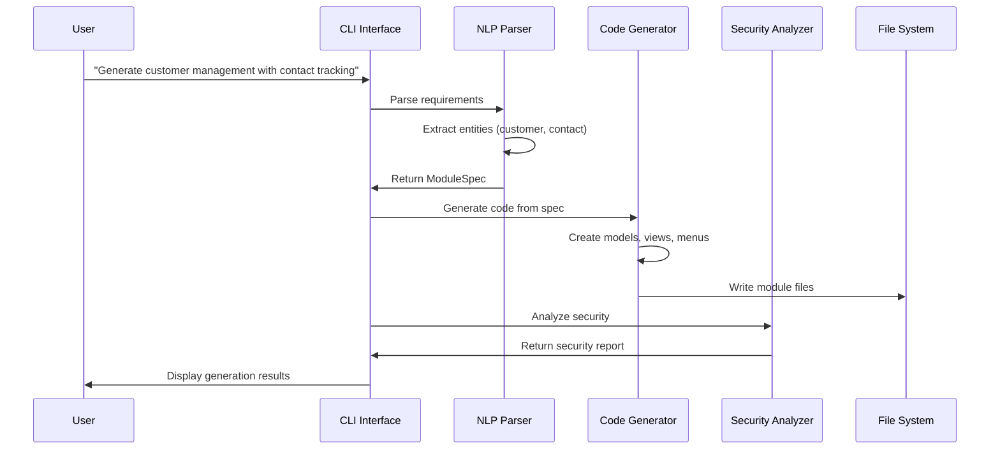
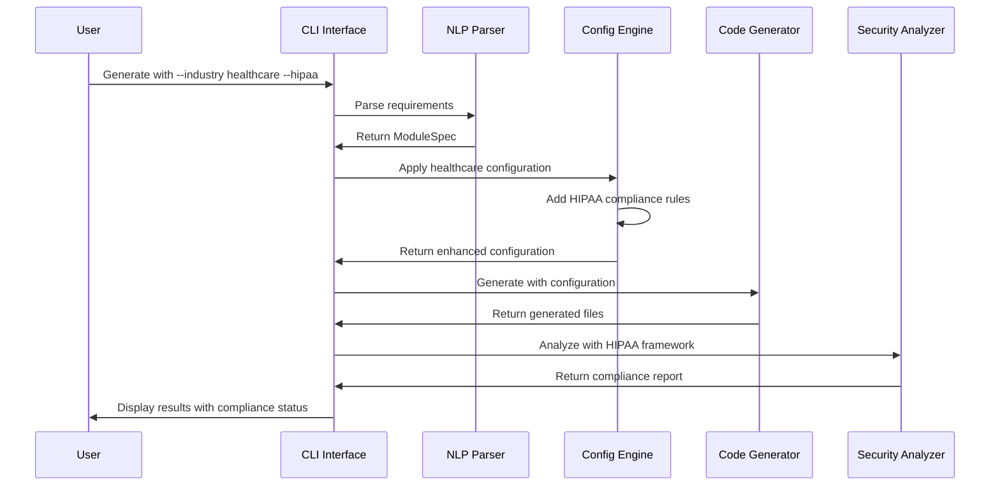
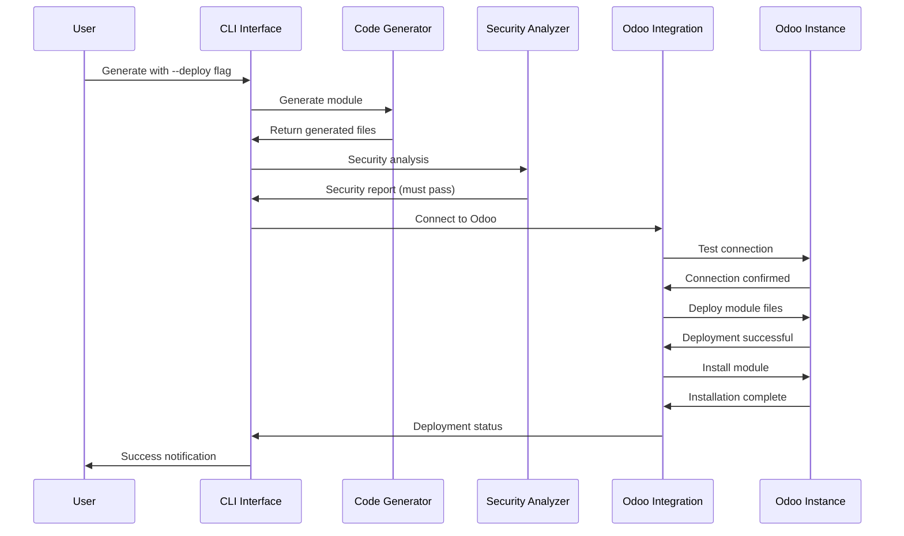
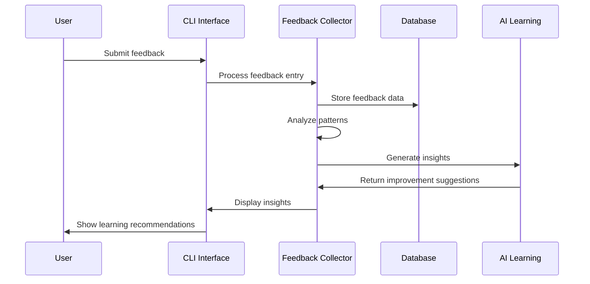
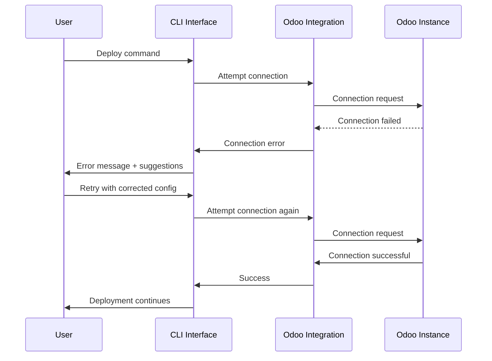
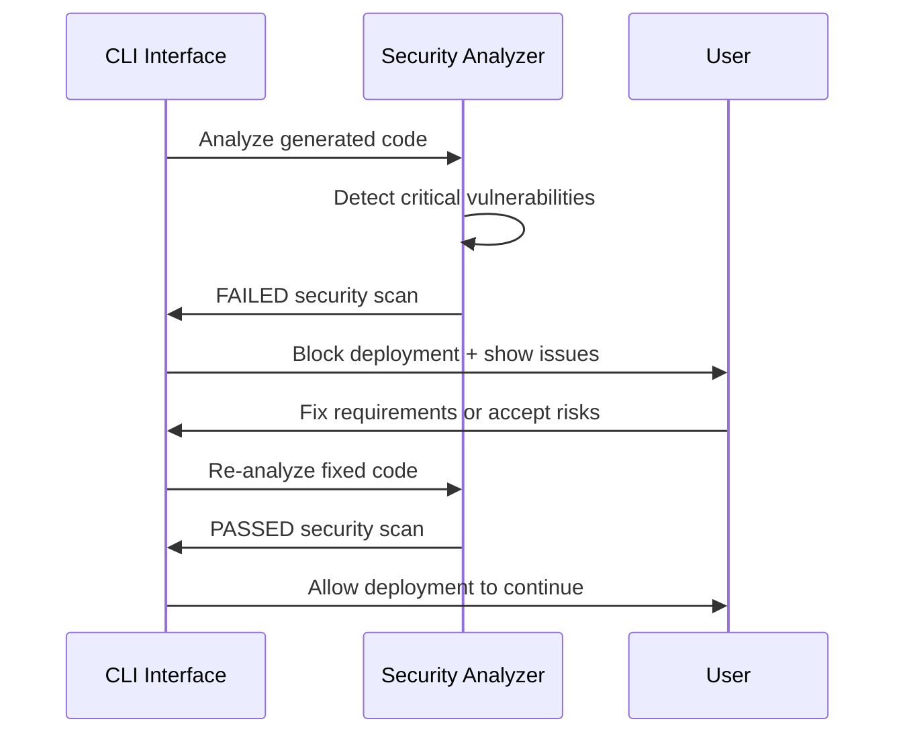

# User Flows and Interaction Patterns

This document describes the various user interaction flows supported by the AI-Driven Odoo SaaS Platform, from simple module generation to complex enterprise deployments.

## Primary User Flows

### 1. Simple Module Generation Flow

#### Scenario: Basic CRM Module
**User Goal**: Create a simple customer management module



#### Step-by-Step Process
1. **User Input**
   ```bash
   odoo-ai-generator generate "I need a customer management system with contact tracking"
   ```

2. **Requirement Analysis**
   - Extract entities: customer, contact
   - Identify relationships: customer has contacts
   - Determine fields: name, email, phone, address
   - Suggest views: form, tree, kanban

3. **Code Generation**
   - Create `custom_customer_management` module
   - Generate customer model with appropriate fields
   - Create contact model with many2one to customer
   - Generate form and tree views
   - Add menu structure

4. **Security Analysis**
   - Scan for vulnerabilities
   - Check access rights
   - Validate field permissions

5. **Output**
   ```
   ✓ Module generated: custom_customer_management
   ✓ Models created: 2
   ✓ Views created: 4
   ✓ Security scan: PASSED (Score: 95/100)
   ✓ Files written to: ./generated_modules/custom_customer_management/
   ```

### 2. Advanced Configuration Flow

#### Scenario: Industry-Specific Module with Compliance
**User Goal**: Create healthcare module with HIPAA compliance



#### Command Example
```bash
odoo-ai-generator generate \
  "Patient record management with medical history tracking" \
  --industry healthcare \
  --hipaa \
  --security-scan \
  --security-report hipaa-compliance.txt
```

#### Enhanced Features
- **Industry Templates**: Healthcare-specific field types and workflows
- **Compliance Rules**: HIPAA data protection requirements
- **Security Enhancements**: Encryption fields, audit trails
- **Workflow Optimization**: Medical approval processes

### 3. Full Deployment Flow

#### Scenario: Generate and Deploy to Production
**User Goal**: Create module and deploy to live Odoo instance



#### Configuration Setup
1. **Create Odoo Configuration**
   ```json
   {
     "url": "production.odoo.com",
     "database": "prod_db",
     "username": "admin",
     "password": "secure_password",
     "port": 443,
     "protocol": "https"
   }
   ```

2. **Deployment Command**
   ```bash
   odoo-ai-generator generate \
     "Sales pipeline management with lead scoring" \
     --deploy \
     --odoo-config prod-config.json \
     --addons-path /opt/odoo/custom-addons \
     --security-scan
   ```

3. **Automated Process**
   - Generate module
   - Security validation (must pass)
   - Connect to Odoo instance
   - Deploy to addons directory
   - Update modules list
   - Install module
   - Verify installation

### 4. Feedback and Learning Flow

#### Scenario: Continuous Improvement Through Usage Data
**User Goal**: Improve AI accuracy through feedback



#### Feedback Submission
```bash
# Submit rating feedback
odoo-ai-generator submit-feedback \
  my_crm_module user123 \
  --type rating \
  --rating 4 \
  --content "Great module, but forms could be simpler"

# Submit bug report
odoo-ai-generator submit-feedback \
  inventory_module user456 \
  --type bug_report \
  --content "Stock calculation errors in multi-location setup"
```

#### Analytics and Insights
```bash
# Analyze feedback patterns
odoo-ai-generator feedback --insights --days 30

# Module-specific analysis
odoo-ai-generator feedback --module my_crm_module --insights
```

## Secondary User Flows

### 5. Testing and Validation Flow

#### Pre-Deployment Testing
```bash
# Generate module with test cases
odoo-ai-generator generate \
  "Inventory management with barcode scanning" \
  --output-dir ./test_modules \
  --security-scan \
  --configure

# Validate generated code
cd test_modules/custom_inventory_management
python -m py_compile models/*.py  # Syntax check
flake8 models/  # Style check
```

#### Security Validation
```bash
# Detailed security analysis
odoo-ai-generator generate \
  "Financial reporting with sensitive data" \
  --security-scan \
  --security-report detailed-security.txt \
  --gdpr

# Review security report
cat detailed-security.txt
```

### 6. Iterative Development Flow

#### Scenario: Refining Requirements Through Iterations

1. **Initial Generation**
   ```bash
   odoo-ai-generator generate "Basic project management"
   ```

2. **Review and Feedback**
   ```bash
   # User reviews generated module
   # Provides feedback through CLI or usage
   ```

3. **Refined Generation**
   ```bash
   odoo-ai-generator generate \
     "Project management with time tracking, milestone management, and team collaboration" \
     --configure \
     --industry "software_development"
   ```

4. **Continuous Improvement**
   - AI learns from user modifications
   - Patterns are incorporated into future generations
   - Templates are updated based on successful patterns

### 7. Multi-Module Project Flow

#### Scenario: Complex Business Solution
**User Goal**: Create integrated business solution with multiple modules

```bash
# Generate core customer module
odoo-ai-generator generate \
  "Customer relationship management with lead tracking" \
  --output-dir ./business_solution

# Generate sales module
odoo-ai-generator generate \
  "Sales order management with quotation system linked to customers" \
  --output-dir ./business_solution

# Generate inventory module  
odoo-ai-generator generate \
  "Inventory management linked to sales orders" \
  --output-dir ./business_solution

# Deploy entire solution
odoo-ai-generator deploy-solution \
  --solution-dir ./business_solution \
  --odoo-config config.json
```

## Error Handling Flows

### 8. Connection Failure Recovery



#### Recovery Steps
1. **Diagnose Issue**
   ```bash
   odoo-ai-generator test-connection config.json
   ```

2. **Fix Configuration**
   - Update credentials
   - Check network connectivity
   - Verify Odoo instance status

3. **Retry Deployment**
   ```bash
   odoo-ai-generator generate --deploy --retry
   ```

### 9. Security Failure Flow



#### Security Issue Resolution
1. **Review Security Report**
   ```
   [CRITICAL] SQL Injection vulnerability in search functionality
   File: models/customer.py:45
   Recommendation: Use parameterized queries
   ```

2. **Modify Requirements**
   - Add explicit security requirements
   - Request safer implementation patterns
   - Enable additional validation

3. **Re-generate with Fixes**
   ```bash
   odoo-ai-generator generate \
     "Secure customer search with parameterized queries" \
     --security-scan
   ```

## Advanced User Flows

### 10. Custom Template Flow

#### Scenario: Organization-Specific Standards
**User Goal**: Use custom templates for consistent output

1. **Create Custom Templates**
   ```bash
   mkdir custom_templates
   # Add organization-specific Jinja2 templates
   ```

2. **Generate with Custom Templates**
   ```bash
   odoo-ai-generator generate \
     "Employee management system" \
     --template-dir ./custom_templates \
     --configure
   ```

3. **Template Inheritance**
   - Base templates for common patterns
   - Industry-specific extensions
   - Organization customizations

### 11. Batch Processing Flow

#### Scenario: Multiple Module Generation
**User Goal**: Generate multiple related modules

```bash
# Batch file with multiple requirements
cat requirements.txt
```
```
Customer management with contact tracking
Sales pipeline with opportunity management  
Inventory management with stock tracking
Financial reporting with dashboard
```

```bash
# Process batch requirements
odoo-ai-generator batch-generate \
  --input requirements.txt \
  --output-dir ./enterprise_solution \
  --configure \
  --security-scan
```

### 12. Integration Testing Flow

#### Scenario: Validate Module Interactions
**User Goal**: Ensure modules work together correctly

```bash
# Generate integrated test suite
odoo-ai-generator generate-integration-tests \
  --modules ./enterprise_solution \
  --test-scenarios ./test_scenarios.yml

# Run integration tests
odoo-ai-generator run-integration-tests \
  --odoo-config test-config.json \
  --modules ./enterprise_solution
```

## Performance Optimization Flows

### 13. Large Module Generation

#### Optimizations for Complex Requirements
- **Streaming Generation**: Process large specifications in chunks
- **Parallel Processing**: Generate multiple components simultaneously  
- **Memory Management**: Efficient handling of large codebases
- **Incremental Updates**: Only regenerate changed components

```bash
# Enable performance optimizations
odoo-ai-generator generate \
  "Complete ERP solution with 20+ modules" \
  --parallel \
  --streaming \
  --incremental \
  --memory-limit 4GB
```

## User Experience Patterns

### 14. Progressive Disclosure

#### Beginner → Advanced User Journey

1. **Beginner**: Simple commands, guided prompts
   ```bash
   odoo-ai-generator quick-start
   # Interactive wizard guides through process
   ```

2. **Intermediate**: Standard CLI with common options
   ```bash
   odoo-ai-generator generate "CRM system" --configure --deploy
   ```

3. **Advanced**: Full control with all options
   ```bash
   odoo-ai-generator generate \
     --spec-file complex-requirements.json \
     --template-dir custom_templates \
     --config advanced-config.yml \
     --plugins security,performance,compliance \
     --output-format structured \
     --validation-level strict
   ```

### 15. Collaborative Flows

#### Team Development Scenarios

1. **Requirement Gathering**
   ```bash
   # Business analyst creates initial spec
   odoo-ai-generator create-spec \
     --interactive \
     --stakeholders "sales,support,management" \
     --output requirements-v1.json
   ```

2. **Technical Review**
   ```bash
   # Developer reviews and refines
   odoo-ai-generator review-spec \
     --input requirements-v1.json \
     --technical-review \
     --output requirements-v2.json
   ```

3. **Generation and Testing**
   ```bash
   # Generate and test
   odoo-ai-generator generate \
     --spec-file requirements-v2.json \
     --test-environment staging \
     --notify-team
   ```

4. **Deployment Approval**
   ```bash
   # Manager approves deployment
   odoo-ai-generator deploy \
     --approval-required \
     --approver-email manager@company.com \
     --production-config prod.json
   ```

These user flows demonstrate the flexibility and power of the AI-Driven Odoo SaaS Platform, supporting everything from simple module generation to complex enterprise deployments with full security, compliance, and collaboration features.